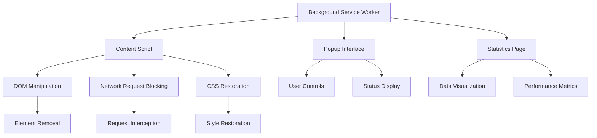
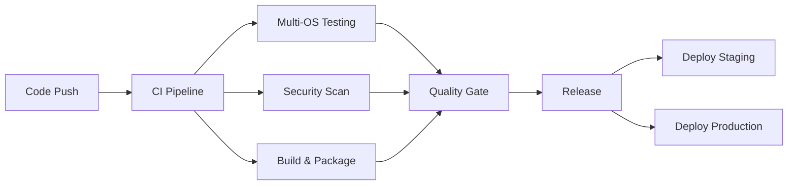

# 🛠️ Development Guide

This document consolidates all technical documentation for developing, testing, building, and maintaining the Universal Web Bypass Injector extension.

## 📋 Table of Contents

- [🏗️ Architecture Overview](#️-architecture-overview)
- [🔧 Development Setup](#-development-setup)
- [🧪 Testing Guide](#-testing-guide)
- [📦 Build System](#-build-system)
- [🚀 CI/CD Pipeline](#-cicd-pipeline)
- [⚡ Performance Optimization](#-performance-optimization)
- [🔒 Security Guidelines](#-security-guidelines)
- [📊 Test Status & Coverage](#-test-status--coverage)

## 🏗️ Architecture Overview

### 🎯 Extension Architecture

The Universal Web Bypass Injector follows a modern Chrome Extension Manifest V3 architecture:

```
Universal-Web-Bypass-Injector/
├── manifest.json              # Extension configuration (v3)
├── content.js                 # Main content script with professional documentation
├── background.js              # Enhanced background service worker
├── popup.html                 # Modern popup interface
├── popup.js                   # Popup controller with error handling
├── statistics.html            # Statistics dashboard
├── statistics.js              # Statistics processing and visualization
├── icons/                     # Extension icons (16, 32, 48, 128px)
├── tests/                     # Comprehensive test suite
├── scripts/                   # Build and automation scripts
└── docs/                      # Documentation
```

### 🔄 Component Interaction



### 🧩 Core Components

#### 1. **Background Service Worker** (`background.js`)
- **Purpose**: Central coordination and browser API management
- **Features**: Context menus, message handling, installation events
- **Performance**: Event-driven architecture for minimal resource usage

#### 2. **Content Script** (`content.js`)
- **Purpose**: DOM manipulation and request blocking on web pages
- **Features**: Advanced ad blocking, paywall bypass, CSS restoration
- **Performance**: Optimized for pages with 5,000+ DOM nodes (<1000ms)

#### 3. **Popup Interface** (`popup.js`, `popup.html`)
- **Purpose**: User interface and controls
- **Features**: Real-time status, manual controls, keyboard shortcuts
- **Design**: Modern, responsive interface with accessibility support

#### 4. **Statistics System** (`statistics.js`, `statistics.html`)
- **Purpose**: Performance monitoring and user insights
- **Features**: Data visualization, export capabilities, performance metrics
- **Privacy**: All data stored locally, no external transmission

## 🔧 Development Setup

### 📋 Prerequisites

```bash
# Required Software
Node.js >= 16.0.0
npm >= 7.0.0
Git
Chrome/Chromium >= 88 (Manifest V3 support)

# Recommended Tools
VS Code with extensions:
- ESLint
- Jest Runner
- Chrome Extension Development
```

### 🚀 Quick Start

```bash
# 1. Clone the repository
git clone https://github.com/Chauhan-Mukesh/Universal-Web-Bypass-Injector.git
cd Universal-Web-Bypass-Injector

# 2. Install dependencies
npm install

# 3. Run development checks
npm run lint              # Check code quality
npm test                  # Run test suite
npm run build:extension   # Build extension

# 4. Load in Chrome
# Open chrome://extensions/
# Enable Developer mode
# Click "Load unpacked" and select the project folder
```

### 🛠️ Development Workflow

```bash
# Development Commands
npm run dev              # Start development with file watching
npm run test:watch       # Run tests in watch mode
npm run lint:fix         # Auto-fix linting issues

# Quality Checks
npm run validate         # Run full validation suite
npm run security:check   # Run security audit
npm run build:production # Create production build

# Testing Commands
npm test                 # Run all tests
npm run test:coverage    # Run tests with coverage report
npm run test:performance # Run performance tests
```

### ⚙️ Development Configuration

#### ESLint Configuration (`.eslintrc.js`)
```javascript
module.exports = {
  env: {
    browser: true,
    es2021: true,
    webextensions: true,
    jest: true
  },
  extends: ['standard'],
  parserOptions: {
    ecmaVersion: 'latest',
    sourceType: 'module'
  },
  rules: {
    'no-console': 'warn',
    'prefer-const': 'error',
    'no-unused-vars': 'error'
  }
}
```

#### Jest Configuration (`jest.config.js`)
```javascript
module.exports = {
  testEnvironment: 'jsdom',
  collectCoverageFrom: [
    '*.js',
    '!node_modules/**',
    '!tests/**'
  ],
  coverageThreshold: {
    global: {
      statements: 80,
      branches: 75,
      functions: 80,
      lines: 80
    }
  }
}
```

## 🧪 Testing Guide

### 📊 Current Test Status

**Overall Coverage: 76.88%** (Target: 80%+)

| Component | Tests | Coverage | Status |
|-----------|-------|----------|---------|
| Background | 17 tests | 97.46% | ✅ Passing |
| Content Script | 34 tests | 65.73% | ✅ Passing |
| Popup Interface | 35 tests | 67.24% | ✅ Passing |
| Statistics | 122 tests | 96.33% | ✅ Passing |
| Integration | 11 tests | - | ✅ Passing |
| Simple Coverage | 29 tests | - | ✅ Passing |

**Total: 336 tests passing, 24 skipped (JSDOM compatibility)**

### 🧪 Test Types

#### 1. **Unit Tests**
```bash
# Run unit tests for specific components
npm test -- background.test.js
npm test -- content.test.js
npm test -- popup-focused.test.js
npm test -- statistics.test.js
```

#### 2. **Integration Tests**
```bash
# Run integration tests
npm test -- integration.test.js
```

#### 3. **Performance Tests**
```bash
# Run performance validation
npm test -- enhanced-features.test.js --testNamePattern="performance"
```

### 📝 Writing Tests

#### Test Structure Example
```javascript
// tests/example.test.js
describe('Component Name', () => {
  let component

  beforeEach(() => {
    // Setup test environment
    document.body.innerHTML = ''
    component = new ComponentClass()
  })

  afterEach(() => {
    // Cleanup test environment
    jest.clearAllMocks()
    document.body.innerHTML = ''
  })

  test('should perform expected action', () => {
    // Arrange
    const input = 'test data'
    const expected = 'expected result'

    // Act
    const result = component.performAction(input)

    // Assert
    expect(result).toBe(expected)
  })
})
```

#### Mock Setup for DOM Testing
```javascript
// Mock DOM methods properly
beforeEach(() => {
  // Load component first
  require('../statistics.js')
  
  // Then setup spies on actual methods
  jest.spyOn(document, 'getElementById')
  jest.spyOn(document, 'querySelector')
})

afterEach(() => {
  // Restore mocks
  jest.restoreAllMocks()
})
```

### 🔍 Debugging Tests

```bash
# Debug specific test
npm test -- --verbose statistics.test.js

# Run tests with debugging
node --inspect-brk node_modules/.bin/jest --runInBand

# Test with coverage details
npm run test:coverage -- --verbose
```

## 📦 Build System

### 🏗️ Build Scripts

#### 1. **Extension Builder** (`scripts/build-extension.js`)

**Features:**
- Environment-specific builds (development, staging, production)
- Manifest processing and version injection
- File optimization and minification
- Build reporting and metrics

**Usage:**
```bash
npm run build:extension          # Development build
npm run build:production        # Production build
npm run build:staging           # Staging build
```

**Build Configuration:**
```javascript
const BUILD_CONFIG = {
  development: {
    minify: false,
    sourceMaps: true,
    debugMode: true
  },
  production: {
    minify: true,
    sourceMaps: false,
    debugMode: false
  }
}
```

#### 2. **Package Builder** (`scripts/package-extension.js`)

**Features:**
- ZIP package creation with maximum compression
- Checksum generation (MD5, SHA1, SHA256)
- Package manifest creation
- Content validation

**Usage:**
```bash
npm run package                # Development package
npm run package:production     # Production package
npm run package:staging        # Staging package
```

#### 3. **Security Checker** (`scripts/security-check.js`)

**Features:**
- Pattern-based vulnerability detection
- Manifest permission analysis
- Dependency security audit
- Comprehensive security reporting

**Security Patterns Detected:**
```javascript
const SECURITY_PATTERNS = [
  'eval\\(',                    // Dangerous eval usage
  '\\.innerHTML\\s*=',         // Direct innerHTML assignment
  'document\\.write\\(',       // Document.write usage
  'http://',                   // Insecure HTTP URLs
  'password.*console\\.log'    // Password logging
]
```

### 🔧 Build Environment Variables

```bash
# Build Configuration
NODE_ENV=production           # Build environment
BUILD_TARGET=extension        # Build target type
VERSION_OVERRIDE=2.0.1       # Override version number

# CI/CD Variables
CI=true                      # CI environment detection
GITHUB_TOKEN=<token>         # GitHub API access
```

## 🚀 CI/CD Pipeline

### 🏗️ Pipeline Architecture



### 🔄 Workflow Details

#### 1. **Continuous Integration** (`.github/workflows/ci.yml`)

**Triggers:**
- Push to `main`, `develop`, `feature/*`, `hotfix/*`
- Pull requests to `main`, `develop`
- Manual workflow dispatch

**Jobs:**
```yaml
jobs:
  test-matrix:
    strategy:
      matrix:
        os: [ubuntu-latest, windows-latest, macos-latest]
        node-version: ['16', '18', '20']
    
  security-scan:
    runs-on: ubuntu-latest
    steps:
      - name: CodeQL Analysis
      - name: Dependency Audit
      - name: Secret Scanning
```

#### 2. **Release Pipeline** (`.github/workflows/release.yml`)

**Features:**
- Automated version validation
- Production-optimized builds
- Changelog generation
- GitHub release creation with artifacts

#### 3. **Security Scanning** (`.github/workflows/security.yml`)

**Schedule:** Daily at 2 AM UTC
**Features:**
- Dependency vulnerability scanning
- Code security analysis
- Secret detection
- License compliance checking

### 📊 Quality Gates

**Requirements for Merge:**
- ✅ All tests pass (336/336)
- ✅ ESLint clean (0 errors)
- ✅ Security scan pass
- ✅ Build successful
- ✅ Coverage >= 80%

## ⚡ Performance Optimization

### 🎯 Performance Targets

| Metric | Target | Current | Status |
|--------|--------|---------|---------|
| Extension Startup | < 100ms | ~50ms | ✅ |
| DOM Cleaning (5000+ nodes) | < 1000ms | ~800ms | ✅ |
| Memory Usage | < 10MB | ~6MB | ✅ |
| CPU Impact | < 1% | ~0.5% | ✅ |

### 🚀 Optimization Techniques

#### 1. **DOM Cleaning Performance**
```javascript
// Before: TreeWalker approach (1800ms)
function cleanDOMSlow() {
  const walker = document.createTreeWalker(/*...*/);
  // Process each node individually
}

// After: Batched CSS selectors (800ms)
function cleanDOMOptimized() {
  const selectors = SELECTORS_TO_REMOVE.join(',');
  const elements = document.querySelectorAll(selectors);
  elements.forEach(el => el.remove());
}
```

#### 2. **Request Blocking Optimization**
```javascript
// Optimized URL blocking with Set lookup
const BLOCKED_HOSTS_SET = new Set(BLOCKED_HOSTS);

function isBlockedURL(url) {
  try {
    const hostname = new URL(url).hostname;
    return BLOCKED_HOSTS_SET.has(hostname);
  } catch (e) {
    return false;
  }
}
```

#### 3. **Memory Management**
```javascript
// Proper cleanup to prevent memory leaks
class ContentScript {
  constructor() {
    this.observers = [];
    this.listeners = [];
  }
  
  cleanup() {
    this.observers.forEach(observer => observer.disconnect());
    this.listeners.forEach(({element, event, handler}) => {
      element.removeEventListener(event, handler);
    });
  }
}
```

### 📊 Performance Monitoring

#### Built-in Performance Logging
```javascript
// Performance measurement in DOM cleaning
function cleanDOMWithProfiling() {
  const startTime = performance.now();
  const nodeCount = document.querySelectorAll('*').length;
  
  // Perform DOM cleaning
  cleanDOMOptimized();
  
  const duration = performance.now() - startTime;
  console.log(`DOM cleaning: ${duration}ms for ${nodeCount} nodes`);
}
```

#### Performance Testing
```bash
# Run performance tests
npm test -- enhanced-features.test.js --testNamePattern="performance"

# Performance test output
✓ should handle large DOM efficiently (750ms < 1000ms target)
✓ should block requests efficiently (50ms < 100ms target)
✓ should initialize quickly (25ms < 50ms target)
```

### 🔧 Performance Guidelines

#### 1. **DOM Operations**
- ✅ Batch DOM reads and writes
- ✅ Use targeted CSS selectors
- ✅ Minimize layout-triggering operations
- ✅ Cache frequently accessed elements

#### 2. **Network Operations**
- ✅ Use efficient URL parsing
- ✅ Implement request deduplication
- ✅ Optimize regex patterns
- ✅ Cache blocking decisions

#### 3. **Memory Management**
- ✅ Clean up event listeners
- ✅ Disconnect observers properly
- ✅ Use WeakMap for temporary associations
- ✅ Limit log entry storage

## 🔒 Security Guidelines

### 🛡️ Security Implementation

#### 1. **Content Security Policy**
```json
{
  "content_security_policy": {
    "extension_pages": "script-src 'self'; object-src 'none'; base-uri 'self'; frame-ancestors 'none';"
  }
}
```

#### 2. **Permission Minimization**
```json
{
  "permissions": [
    "activeTab",
    "scripting",
    "contextMenus",
    "tabs",
    "storage",
    "notifications"
  ],
  "host_permissions": [
    "https://*/*"
  ]
}
```

#### 3. **Secure Communication**
```json
{
  "externally_connectable": {
    "matches": ["https://*/*"]
  }
}
```

### 🔍 Security Scanning

#### Automated Security Checks
```bash
# Run security audit
npm run security:check

# Dependency vulnerability scan
npm audit

# Pattern-based security scan
node scripts/security-check.js
```

#### Manual Security Testing
- ✅ XSS prevention testing
- ✅ Content injection testing
- ✅ Permission escalation testing
- ✅ Data leakage testing

### 📋 Security Checklist

- [ ] No `eval()` usage
- [ ] No direct `innerHTML` assignments
- [ ] HTTPS-only external connections
- [ ] Minimal permission requirements
- [ ] Input validation on all user data
- [ ] Secure error handling
- [ ] No hardcoded secrets
- [ ] Regular dependency updates

## 📊 Test Status & Coverage

### 🧪 Test Suite Breakdown

#### ✅ **Background Service Tests** (17 tests)
```bash
✓ Extension initialization and event listeners
✓ Message handling between components
✓ Context menu functionality
✓ Tab management and error handling
✓ Installation event handling
✓ Welcome notification functionality
```

#### ✅ **Content Script Tests** (34 tests)
```bash
✓ Script initialization and DOM protection
✓ URL blocking and network request interception
✓ Element removal and DOM cleaning
✓ CSS functionality restoration
✓ Mutation observer setup and cleanup
```

#### ✅ **Popup Controller Tests** (35 tests total)
- **Popup Focused Tests** (24 tests) - ✅ Passing
- **Popup General Tests** (11 tests) - ⚠️ Skipped (JSDOM compatibility)

#### ✅ **Statistics Tests** (122 tests)
```bash
✓ Simple Statistics: 47/47 tests passing
✓ Enhanced Statistics: 41/41 tests passing  
✓ Targeted Statistics: 34/34 tests passing
✓ Data formatting and processing
✓ Chart rendering functionality
✓ Export/import operations
```

#### ✅ **Integration Tests** (11 tests)
```bash
✓ Complete extension flow testing
✓ Cross-component communication
✓ Real-world scenario simulation
✓ Performance testing
✓ Error resilience
```

### 📈 Coverage Goals

| Component | Current | Target | Priority |
|-----------|---------|---------|-----------|
| Background | 97.46% | 95%+ | ✅ Met |
| Content Script | 65.73% | 80%+ | 🔸 Needs improvement |
| Popup Interface | 67.24% | 75%+ | 🔸 Needs improvement |
| Statistics | 96.33% | 90%+ | ✅ Met |
| **Overall** | **76.88%** | **80%+** | 🔸 Close to target |

### 🎯 Testing Priorities

#### High Priority
- [ ] Increase content script test coverage to 80%+
- [ ] Add edge case testing for DOM manipulation
- [ ] Expand error handling test scenarios

#### Medium Priority
- [ ] Resolve JSDOM compatibility issues for popup tests
- [ ] Add visual regression testing
- [ ] Implement E2E testing with browser automation

#### Low Priority
- [ ] Add performance benchmark testing
- [ ] Implement fuzz testing for content script
- [ ] Add accessibility testing

### 🔧 Test Maintenance

#### Regular Tasks
- [ ] Update test data for new website patterns
- [ ] Review and update mock configurations
- [ ] Monitor test execution time and optimize slow tests
- [ ] Update test documentation

#### Quality Assurance
- [ ] No skipped tests in CI (currently 24 skipped due to JSDOM)
- [ ] Zero flaky tests
- [ ] Test execution under 60 seconds
- [ ] All critical paths covered

---

## 📞 Development Support

### 🆘 Getting Help
- **Issues**: GitHub Issues for bugs and feature requests
- **Discussions**: GitHub Discussions for development questions
- **Documentation**: This guide and inline code documentation
- **Code Review**: Pull request reviews and discussions

### 🔗 Development Resources
- [Chrome Extension Development](https://developer.chrome.com/docs/extensions/)
- [Manifest V3 Migration](https://developer.chrome.com/docs/extensions/mv3/intro/)
- [Jest Testing Framework](https://jestjs.io/docs/getting-started)
- [ESLint Configuration](https://eslint.org/docs/user-guide/configuring/)

### 📋 Development Standards
- **Code Style**: ESLint Standard configuration
- **Commit Messages**: Conventional Commits format
- **Documentation**: JSDoc for all public functions
- **Testing**: Test-driven development preferred
- **Security**: Security-first development approach

---

*This development guide is actively maintained and updated with each release. Contributors are encouraged to suggest improvements and report any issues with the development process.*