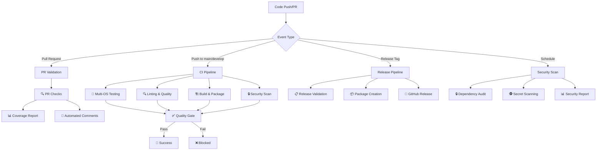

# 📋 CI/CD Workflow Documentation

This document provides comprehensive documentation for the CI/CD pipeline implemented for the Universal Web Bypass Injector Chrome extension.

## 🏗️ Architecture Overview



## 🔄 Workflow Details

### 1. 🧪 Continuous Integration (`ci.yml`)

**Triggers:**
- Push to `main`, `develop`, `feature/*`, `hotfix/*`
- Pull requests to `main`, `develop`
- Manual workflow dispatch

**Jobs:**
- **Pre-flight** - Environment validation and setup
- **Test Matrix** - Multi-OS and Node.js version testing
- **Build** - Extension building and packaging
- **Security** - CodeQL and security scanning
- **Quality Gate** - Final validation and reporting

**Matrix Testing:**
```yaml
strategy:
  matrix:
    os: [ubuntu-latest, windows-latest, macos-latest]
    node-version: ['16', '18', '20']
```

### 2. 🚀 Release Pipeline (`release.yml`)

**Triggers:**
- Release tags (`v*.*.*`)
- Manual workflow dispatch

**Jobs:**
- **Validate** - Release version and format validation
- **Test** - Comprehensive pre-release testing
- **Build** - Production-optimized build
- **Changelog** - Automatic changelog generation
- **Release** - GitHub release creation with artifacts

**Artifact Creation:**
- Extension ZIP package
- Source code archive
- Checksums and signatures
- Release notes

### 3. 🔒 Security Scanning (`security.yml`)

**Triggers:**
- Daily scheduled scan (2 AM UTC)
- Push to main branches
- Pull requests
- Manual dispatch

**Security Checks:**
- **Dependency Scanning** - npm audit and vulnerability detection
- **Code Analysis** - CodeQL security analysis
- **Secret Detection** - TruffleHog and pattern matching
- **License Compliance** - License compatibility checking
- **Security Policy** - Manifest and configuration validation

### 4. 🚀 Deployment Pipeline (`deploy.yml`)

**Triggers:**
- Published releases
- Manual deployment with environment selection

**Environments:**
- **Staging** - Testing environment
- **Production** - Live deployment

**Deployment Steps:**
- Pre-deployment validation
- Environment-specific builds
- Security verification
- Deployment execution
- Post-deployment verification

## 🛠️ Build System

### Build Script (`scripts/build-extension.js`)

**Features:**
- Environment-specific builds (development, staging, production)
- Manifest processing and version injection
- File optimization and minification
- Build reporting and metrics
- Error handling and validation

**Usage:**
```bash
npm run build:extension          # Development build
npm run build:production        # Production build
npm run build:staging          # Staging build
```

### Packaging Script (`scripts/package-extension.js`)

**Features:**
- ZIP package creation with maximum compression
- Checksum generation (MD5, SHA1, SHA256)
- Package manifest creation
- Content validation
- Size optimization reporting

**Usage:**
```bash
npm run package                # Development package
npm run package:production     # Production package
npm run package:staging        # Staging package
```

### Security Check (`scripts/security-check.js`)

**Features:**
- Pattern-based vulnerability detection
- Manifest permission analysis
- Dependency security audit
- Sensitive file detection
- Comprehensive security reporting

**Security Patterns Detected:**
- `eval()` usage
- Direct `innerHTML` assignments
- Hardcoded secrets
- Insecure HTTP URLs
- Password logging

## 📊 Quality Gates

### Code Quality Metrics
- **Linting** - ESLint with Standard configuration
- **Test Coverage** - Minimum 80% coverage requirement
- **Security Score** - Zero critical vulnerabilities
- **Build Success** - All environments must build successfully

### Automated Checks
- **Pre-commit** - Linting and basic tests
- **Pre-push** - Full validation suite
- **Pre-release** - Security and quality validation

## 🔒 Security Implementation

### Multi-layered Security Approach

1. **Source Code Security**
   - Pattern-based vulnerability scanning
   - Secret detection and prevention
   - Code quality enforcement

2. **Dependency Security**
   - Automated vulnerability scanning
   - License compliance checking
   - Regular security updates via Dependabot

3. **Build Security**
   - Secure build environments
   - Artifact verification
   - Checksum validation

4. **Runtime Security**
   - Minimal permission model
   - Content Security Policy enforcement
   - Secure communication protocols

### Security Reporting

**Automated Reports:**
- Daily security scans
- Vulnerability assessments
- Compliance reports
- Security metrics tracking

## 📈 Performance Optimization

### Build Performance
- **Parallel Jobs** - Matrix builds run concurrently
- **Caching** - npm dependencies cached across runs
- **Incremental Builds** - Only changed files processed
- **Resource Optimization** - Efficient resource allocation

### Workflow Optimization
- **Early Termination** - Fail fast on critical errors
- **Smart Triggers** - Context-aware workflow execution
- **Resource Management** - Optimal runner selection
- **Artifact Management** - Efficient storage and retention

## 🔔 Notification System

### Success Notifications
- Build completion status
- Release publication alerts
- Security scan results
- Performance metrics

### Failure Notifications
- Build failure details
- Security vulnerability alerts
- Deployment issues
- Quality gate failures

## 📚 Documentation Integration

### Automated Documentation
- Build reports generation
- Security assessment reports
- Performance metrics
- Changelog automation

### Manual Documentation
- Architecture diagrams
- Workflow descriptions
- Security policies
- Contribution guidelines

## 🚀 Getting Started

### For Contributors

1. **Fork and Clone**
   ```bash
   git clone <your-fork>
   cd Universal-Web-Bypass-Injector
   npm install
   ```

2. **Development Workflow**
   ```bash
   npm run dev              # Start development
   npm run test:watch       # Run tests in watch mode
   npm run lint:fix         # Fix linting issues
   ```

3. **Before Committing**
   ```bash
   npm run precommit        # Run pre-commit checks
   npm run validate         # Full validation
   ```

### For Maintainers

1. **Release Process**
   ```bash
   npm run release:prepare  # Prepare release
   git tag v1.2.3          # Create release tag
   git push origin v1.2.3  # Trigger release pipeline
   ```

2. **Security Management**
   ```bash
   npm run security:check   # Manual security scan
   npm run security:audit   # Dependency audit
   npm run security:fix     # Fix vulnerabilities
   ```

## 🔧 Configuration

### Environment Variables
- `NODE_ENV` - Build environment (development/staging/production)
- `CI` - CI environment detection
- `GITHUB_TOKEN` - GitHub API access (automatic)

### Workflow Configuration
- Timeouts: 5-20 minutes per job
- Retention: 7-90 days for artifacts
- Concurrency: Auto-cancel for same branch

## 📋 Troubleshooting

### Common Issues

1. **Build Failures**
   - Check Node.js version compatibility
   - Verify dependency installation
   - Review build logs

2. **Security Scan Failures**
   - Review security report
   - Address critical vulnerabilities
   - Update dependencies

3. **Test Failures**
   - Run tests locally first
   - Check for environment differences
   - Review test coverage

### Debug Mode
Enable debug mode for detailed logging:
```yaml
inputs:
  debug_enabled: true
```

## 📞 Support

For CI/CD related issues:
- Check workflow logs in GitHub Actions
- Review this documentation
- Create an issue with workflow details
- Contact maintainers for urgent issues

---

*This documentation is maintained alongside the CI/CD implementation and is updated regularly.*